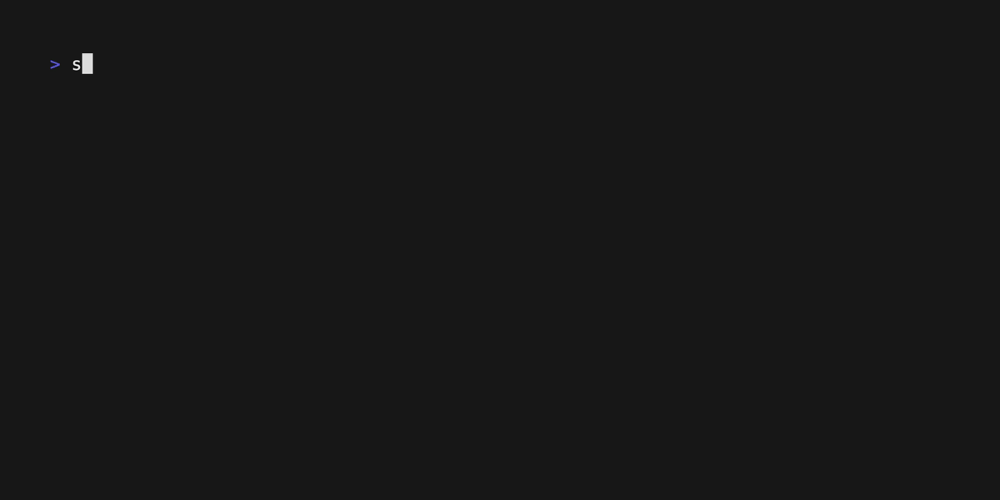

# spotgo
[](https://goreportcard.com/report/github.com/Esteban-Bermudez/spotgo)




A CLI tool for Spotify written in Go

This project is a work in progress. The goal is to create a CLI tool for Spotify that allows users to interact with their currently playing music from the command line.

## Installation
```bash
go install github.com/Esteban-Bermudez/spotgo/cmd/spotgo@latest
```
Or install the binary from the [releases page](https://github.com/Esteban-Bermudez/spotgo/releases)

Once the binary is installed, you can add it to your `$PATH` for easy access.
Make sure to also include your Spotify `client_id` as an environment variable.
```bash
export SPOTIFY_CLIENT_ID=<YOUR_CLIENT_ID>
```

## Usage
```bash
spotgo [command]
```

### `connect`
```bash
spotgo connect
```
This command will open a browser window to authenticate with Spotify. Once authenticated, the user will be redirected to
a page with a success message. The user can then close the browser window and return to the terminal.

### `player`
```bash
spotgo player [sub-command] [flags]
```
This command will display the current playing data from Spotify. The data includes the track name, artist, album,
player state and progress bar. The progress bar will show the current position of the track in relation to the total duration of the
track.

**Sub-Commands**
- `pause` - Pause current Spotify playback
- `play` - Resume current Spotify playback
- `toggle` - Toggle between play and pause states
- `next` - Skip to the next track
- `prev` - Skip to the previous track

**Flags**
- `--one-line` - show playing data in one line (works well with status bars)
- `--no-progress` - hide progress bar in one line mode
- `-s, --scroll int` - scroll the output string if greater than n characters
